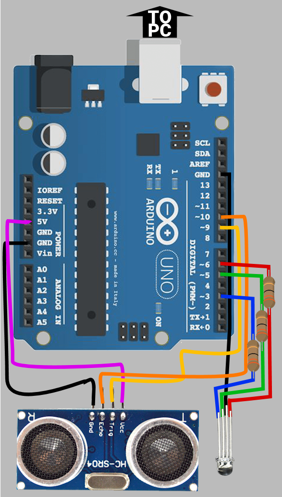

# Non Mus Ultra v0.5

Python music instrument for arduino with an Utrasonic Ranging Module HC SR04

## Author:

### Santiago Chávez Novaro ([@sanxofon](https://twitter.com/sanxofon))

## Example use:

	$ python musultra.py -p -e Ryosen -d 3 -t C -a 440.0 -x COM11

## Show help:

	$ python musultra.py -h

## ToDo:

	- Send max and min limits to arduino on startup and transfer (& test) calibration script to arduino itself.
	- Improve RGB heat-map color settings

## Arduino set-up:

